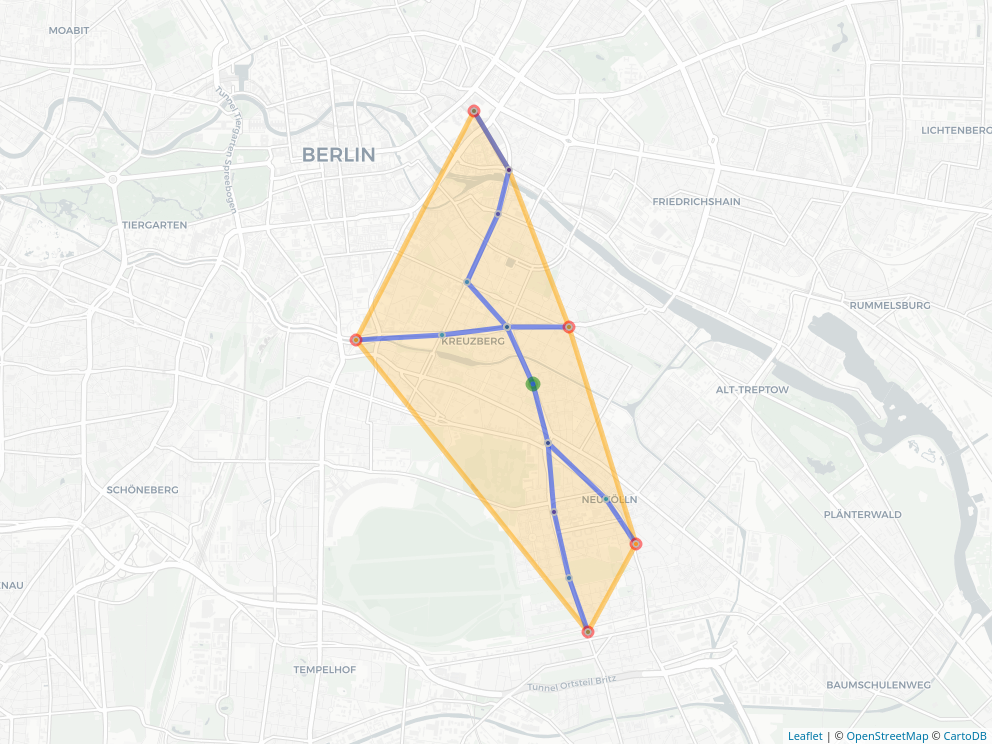

[](https://travis-ci.org/ATFutures/gtfs-router) 
[](https://ci.appveyor.com/project/ATFutures/gtfs-router)
[](https://codecov.io/gh/ATFutures/gtfs-router)
[](https://www.repostatus.org/#wip)


# GTFS Router

**R** package for routing and analysis with [GTFS (General Transit Feed
Specification)](https://developers.google.com/transit/gtfs/) data. 

## Installation

To install:
```{r remotes, eval=FALSE}
remotes::install_github("atfutures/gtfs-router")
```
```{r load_all, echo = FALSE, message = FALSE}
devtools::load_all (".", export_all = FALSE)
```


To load the package and check the version:
```{r pkg-version, eval=TRUE}
library(gtfsrouter)
packageVersion("gtfsrouter")
```

## Main functions

The main functions can be demonstrated with sample data from Berlin (the
Verkehrverbund Berlin Brandenburg, or VBB), included with the package. GTFS data
are always stored as `.zip` files, and these sample data can be written to local
storage with the function `berlin_gtfs_to_zip()`.
```{r create-zip, eval = TRUE}
berlin_gtfs_to_zip()
tempfiles <- list.files (tempdir (), full.names = TRUE)
filename <- tempfiles [grep ("vbb.zip", tempfiles)]
filename
```
For normal package use, `filename` will specify the name of the local GTFS data
stored as a single `.zip` file. 

### gtfs_route

Given the name of a GTFS `.zip` file, `filename`, routing is as simple as the
following code:
```{r example-echo, echo = TRUE, eval = FALSE}
gtfs <- extract_gtfs (filename)
gtfs <- gtfs_timetable (gtfs) # A pre-processing step to speed up queries
gtfs_route (gtfs,
            from = "Schonlein",
            to = "Berlin Hauptbahnhof",
            start_time = 12 * 3600 + 120) # 12:02 in seconds
```
```{r example, echo = FALSE, message = FALSE}
gtfs <- extract_gtfs (filename)
gtfs <- gtfs_timetable (gtfs) # A pre-processing step to speed up queries
r <- gtfs_route (gtfs,
                 from = "Schonlein",
                 to = "Berlin Hauptbahnhof",
                 start_time = 12 * 3600 + 120) # 12:02 in seconds
knitr::kable (r)
```

### gtfs_isochrone

Isochrones from a nominated station - lines delinating the range reachable
within a given time - can be extracted with the `gtfs_isochrone()` function,
which returns a list of all stations reachable within the specified time period
from the nominated station station.
```{r isochrone, eval = TRUE, message = FALSE}
gtfs <- extract_gtfs (filename)
gtfs <- gtfs_timetable (gtfs) # A pre-processing step to speed up queries
x <- gtfs_isochrone (gtfs,
                     from = "Schonlein",
                     start_time = 12 * 3600 + 120,
                     end_time = 12 * 3600 + 720) # 10 minutes later
```

The function returns an object of class `gtfs_isochrone` containing
[`sf`](https://github.com/r-spatial/sf)-formatted sets of start and end points,
along with all intermediate ("mid") points, and routes. An additional item
contains the non-convex (alpha) hull enclosing the routed points.
This requires the packages
[`geodist`](https://github.com/hypertidy/geodist), 
[`sf`](https://cran.r-project.org/package=sf),
[`alphahull`](https://cran.r-project.org/package=alphahull), and
[`mapview`](https://cran.r-project.org/package=mapview) to be installed.
Isochrone objects have their own plot method:
```{r plot, eval = FALSE, message = FALSE}
plot (x)
```
```{r mapshot, echo = FALSE}
m <- plot (x)
mapview::mapshot (m, file = "isochrone.png")
```


The isochrone hull also quantifies its total area and width-to-length ratio.


## GTFS Structure

For background information, see [`gtfs.org`](http://gtfs.org), and particularly
their [GTFS
Examples](https://docs.google.com/document/d/16inL5BVcM1aU-_DcFJay_tC6Ni0wPa0nvQEstueG5k4/edit).
The VBB is strictly schedule-only, so has no `"frequencies.txt"` file (this file
defines "service periods", and overrides any schedule information during the
specified times).

