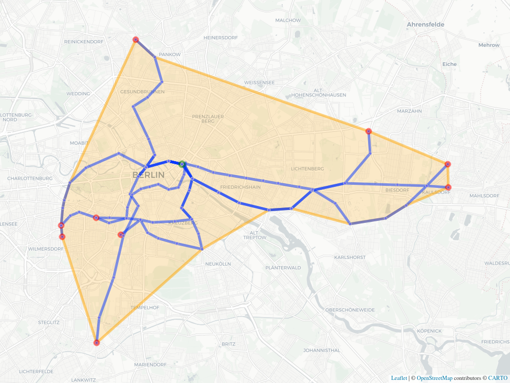

[](https://github.com/atfutures/gtfs-router/actions?query=workflow%3AR-CMD-check)
[](https://travis-ci.org/ATFutures/gtfs-router)
[](https://codecov.io/gh/ATFutures/gtfs-router)
[](https://www.repostatus.org/#active)
[](https://cran.r-project.org/package=gtfsrouter)
[](https://cran.r-project.org/package=gtfsrouter)

# GTFS Router

**R** package for routing with [GTFS (General Transit Feed
Specification)](https://developers.google.com/transit/gtfs/) data. See
[the website](https://atfutures.github.io/gtfs-router/) for full
details.

## Installation

To install:

``` r
remotes::install_github("atfutures/gtfs-router")
```

You can install latest stable version of `gtfsrouter` from CRAN with:

``` r
install.packages("gtfsrouter") # current CRAN version
```

Alternatively, current development versions can be installed using any
of the following options:

``` r
# install.packages("remotes")
remotes::install_git("https://git.sr.ht/~mpadge/gtfsrouter")
remotes::install_bitbucket("atfutures/gtfsrouter")
remotes::install_gitlab("atfutures1/gtfsrouter")
remotes::install_github("ATFutures/gtfsrouter")
```

To load the package and check the version:

``` r
library(gtfsrouter)
packageVersion("gtfsrouter")
```

    ## [1] '0.0.1.31'

## Main functions

The main functions can be demonstrated with sample data included with
the package from Berlin (the Verkehrverbund Berlin Brandenburg, or VBB).
GTFS data are always stored as `.zip` files, and these sample data can
be written to local storage with the function `berlin_gtfs_to_zip()`.

``` r
berlin_gtfs_to_zip()
tempfiles <- list.files (tempdir (), full.names = TRUE)
filename <- tempfiles [grep ("vbb.zip", tempfiles)]
filename
```

    ## [1] "/tmp/RtmpctrGeB/vbb.zip"

For normal package use, `filename` will specify the name of the local
GTFS data stored as a single `.zip` file.

### gtfs\_route

Given the name of a GTFS `.zip` file, `filename`, routing is as simple
as the following code:

``` r
gtfs <- extract_gtfs (filename)
gtfs <- gtfs_timetable (gtfs) # A pre-processing step to speed up queries
gtfs_route (gtfs,
            from = "Schonlein",
            to = "Berlin Hauptbahnhof",
            start_time = 12 * 3600 + 120) # 12:02 in seconds
```

| route\_name | trip\_name       | stop\_name                      | arrival\_time | departure\_time |
| :---------- | :--------------- | :------------------------------ | :------------ | :-------------- |
| U8          | U Paracelsus-Bad | U Schonleinstr. (Berlin)        | 12:04:00      | 12:04:00        |
| U8          | U Paracelsus-Bad | U Kottbusser Tor (Berlin)       | 12:06:00      | 12:06:00        |
| U8          | U Paracelsus-Bad | U Moritzplatz (Berlin)          | 12:08:00      | 12:08:00        |
| U8          | U Paracelsus-Bad | U Heinrich-Heine-Str. (Berlin)  | 12:09:30      | 12:09:30        |
| U8          | U Paracelsus-Bad | S+U Jannowitzbrucke (Berlin)    | 12:10:30      | 12:10:30        |
| S5          | S Westkreuz      | S+U Jannowitzbrucke (Berlin)    | 12:15:24      | 12:15:54        |
| S5          | S Westkreuz      | S+U Alexanderplatz Bhf (Berlin) | 12:17:24      | 12:18:12        |
| S5          | S Westkreuz      | S Hackescher Markt (Berlin)     | 12:19:24      | 12:19:54        |
| S5          | S Westkreuz      | S+U Friedrichstr. Bhf (Berlin)  | 12:21:24      | 12:22:12        |
| S5          | S Westkreuz      | S+U Berlin Hauptbahnhof         | 12:24:06      | 12:24:42        |

### gtfs\_isochrone

Isochrones from a nominated station - lines delineating the range
reachable within a given time - can be extracted with the
`gtfs_isochrone()` function, which returns a list of all stations
reachable within the specified time period from the nominated station.

``` r
gtfs <- extract_gtfs (filename)
gtfs <- gtfs_timetable (gtfs) # A pre-processing step to speed up queries
x <- gtfs_isochrone (gtfs,
                     from = "Schonlein",
                     start_time = 12 * 3600 + 120,
                     end_time = 12 * 3600 + 720) # 10 minutes later
```

The function returns an object of class `gtfs_isochrone` containing
[`sf`](https://github.com/r-spatial/sf)-formatted sets of start and end
points, along with all intermediate (“mid”) points, and routes. An
additional item contains the non-convex (alpha) hull enclosing the
routed points. This requires the packages
[`geodist`](https://github.com/hypertidy/geodist),
[`sf`](https://cran.r-project.org/package=sf),
[`alphahull`](https://cran.r-project.org/package=alphahull), and
[`mapview`](https://cran.r-project.org/package=mapview) to be installed.
Isochrone objects have their own plot method:

``` r
plot (x)
```



The isochrone hull also quantifies its total area and width-to-length
ratio.

## Additional Functionality

There are many ways to construct GTFS feeds. For background information,
see [`gtfs.org`](http://gtfs.org), and particularly their [GTFS
Examples](https://docs.google.com/document/d/16inL5BVcM1aU-_DcFJay_tC6Ni0wPa0nvQEstueG5k4/edit).

Feeds may include a “frequencies.txt” table which defines “service
periods”, and overrides any schedule information during the specified
times. The `gtfsrouter` package includes a function,
[`frequencies_to_stop_times()`](https://atfutures.github.io/gtfs-router/reference/frequencies_to_stop_times.html),
to convert “frequencies.txt” tables to equivalent “stop\_times.txt”
entries, to enable the feed to be used for routine.

Feeds may also omit a “transfers.txt” table which otherwise defines
transfer abilities and times between different services. Feeds without
this table can generally not be used for routing, and they exclude the
possibility of transferring between multiple services. The `gtfsrouter`
package also includes a function,
[`gtfs_transfer_table()`](https://atfutures.github.io/gtfs-router/reference/gtfs_transfer_table.html),
which can calculate a transfer table for a given feed, with transfer
times calculated either using straight-line distances (the default), or
using more realistic times routed through the underlying street network.

## Contributors

<!-- ALL-CONTRIBUTORS-LIST:START - Do not remove or modify this section -->

<!-- prettier-ignore-start -->

<!-- markdownlint-disable -->

This project uses the [`allcontributor`
package](https://github.com/mpadge/allcontributor) following the
[all-contributors](https://allcontributors.org) specification.
Contributions of any kind are welcome\!

## Code

<table>

<tr>

<td align="center">

<a href="https://github.com/mpadge">

</a><br>
<a href="https://github.com/ATFutures/gtfs-router/commits?author=mpadge">mpadge</a>

</td>

<td align="center">

<a href="https://github.com/AlexandraKapp">

</a><br>
<a href="https://github.com/ATFutures/gtfs-router/commits?author=AlexandraKapp">AlexandraKapp</a>

</td>

<td align="center">

<a href="https://github.com/stmarcin">

</a><br>
<a href="https://github.com/ATFutures/gtfs-router/commits?author=stmarcin">stmarcin</a>

</td>

</tr>

</table>

## Issue Authors

<table>

<tr>

<td align="center">

<a href="https://github.com/polettif">

</a><br>
<a href="https://github.com/ATFutures/gtfs-router/issues?q=is%3Aissue+author%3Apolettif">polettif</a>

</td>

<td align="center">

<a href="https://github.com/tbuckl">

</a><br>
<a href="https://github.com/ATFutures/gtfs-router/issues?q=is%3Aissue+author%3Atbuckl">tbuckl</a>

</td>

<td align="center">

<a href="https://github.com/sridharraman">

</a><br>
<a href="https://github.com/ATFutures/gtfs-router/issues?q=is%3Aissue+author%3Asridharraman">sridharraman</a>

</td>

<td align="center">

<a href="https://github.com/tuesd4y">

</a><br>
<a href="https://github.com/ATFutures/gtfs-router/issues?q=is%3Aissue+author%3Atuesd4y">tuesd4y</a>

</td>

<td align="center">

<a href="https://github.com/luukvdmeer">

</a><br>
<a href="https://github.com/ATFutures/gtfs-router/issues?q=is%3Aissue+author%3Aluukvdmeer">luukvdmeer</a>

</td>

<td align="center">

<a href="https://github.com/Robinlovelace">

</a><br>
<a href="https://github.com/ATFutures/gtfs-router/issues?q=is%3Aissue+author%3ARobinlovelace">Robinlovelace</a>

</td>

<td align="center">

<a href="https://github.com/orlandoandradeb">

</a><br>
<a href="https://github.com/ATFutures/gtfs-router/issues?q=is%3Aissue+author%3Aorlandoandradeb">orlandoandradeb</a>

</td>

</tr>

<tr>

<td align="center">

<a href="https://github.com/Maxime2506">

</a><br>
<a href="https://github.com/ATFutures/gtfs-router/issues?q=is%3Aissue+author%3AMaxime2506">Maxime2506</a>

</td>

<td align="center">

<a href="https://github.com/chinhqho">

</a><br>
<a href="https://github.com/ATFutures/gtfs-router/issues?q=is%3Aissue+author%3Achinhqho">chinhqho</a>

</td>

<td align="center">

<a href="https://github.com/federicotallis">

</a><br>
<a href="https://github.com/ATFutures/gtfs-router/issues?q=is%3Aissue+author%3Afedericotallis">federicotallis</a>

</td>

<td align="center">

<a href="https://github.com/rafapereirabr">

</a><br>
<a href="https://github.com/ATFutures/gtfs-router/issues?q=is%3Aissue+author%3Arafapereirabr">rafapereirabr</a>

</td>

<td align="center">

<a href="https://github.com/loanho23">

</a><br>
<a href="https://github.com/ATFutures/gtfs-router/issues?q=is%3Aissue+author%3Aloanho23">loanho23</a>

</td>

</tr>

</table>

<!-- markdownlint-enable -->

<!-- prettier-ignore-end -->

<!-- ALL-CONTRIBUTORS-LIST:END -->
